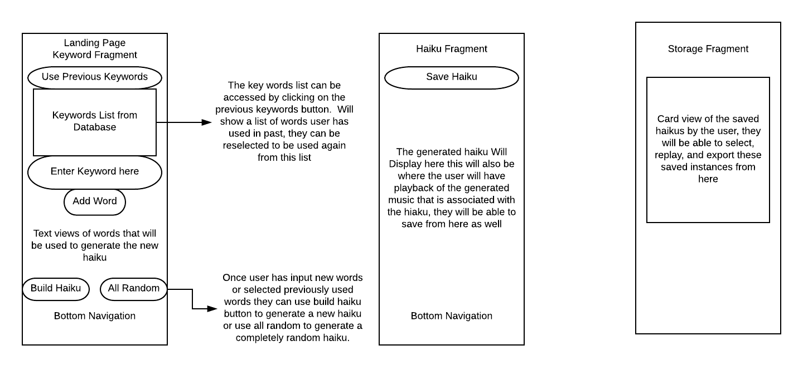

# Wireframes  

Currently I believe that I will be changing my "generate" fragment/activity into a "customoize" fragment or activity and this will need to be changed from the display it currently shows, I still need to decide what will be customizable etc.

This set of wireframes are for reference as far as user interaction, and data entity interaction, these will also be updated as I begin to work further with the particular fragments. They currently show how they landing page is intended to work, and how the "haiku" fragment will work, and has only basic info on the storage fragment.  More to come as I get a better idea on exactly how I want to deal with the fragments as I begin to implement them

